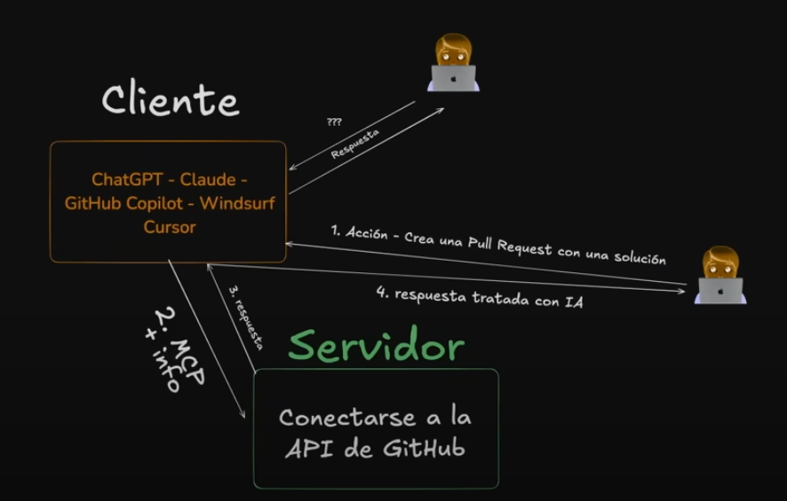
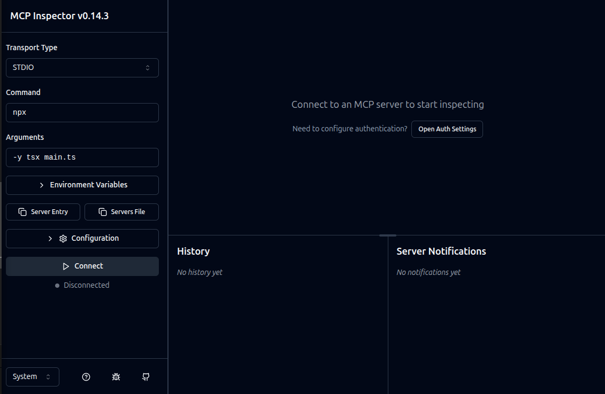

# Aprende MCP - Para principiantes + Crear nuestro primer MCP desde cero

Video de YouTube: `https://www.youtube.com/watch?v=wnHczxwukYY&t=2723s`

MCP (Model Context Protocol), creado por Anthropic, es un protocolo de comunicación que permite a los modelos de lenguaje interactuar con el mundo exterior (servidores, fuentes de datos, herramientas externas), por ejemplo para crear un repositorio o hacer una pull request en GitHub, o saber el tiempo que hace ahora mismo.

Documentación: 

- `https://github.com/modelcontextprotocol`
- `https://modelcontextprotocol.io/introduction`

Cuando se le pregunta a ChatGPT, te da una respuesta, pero no realiza acciones, no puede.

Con MCP conseguimos que la IA realice acciones, nos permiten crear agentes de IA, y hay que indicar que personas ya han hecho MCPs que comercializan. Ver `https://mcp.so/`. Mucho cuidado con los MCPs que se instalan, ya que se pueden usar para robarnos información.

Funcionamiento:

- El cliente hace una petición a ChatGPT.
- ChatGPT mira que MCP (protocolo de comunicación) tiene que usar y lo usa para pasar la información necesaria a un servidor que es el que realiza la acción.
- El servidor devuelve a ChatGPT la respuesta.
- ChatGPT devuelve esa respuesta, tratada como vea conveniente, al cliente.



En este video de YouTube, Midudev nos enseña a crear un MCP desde cero y a utilizar MCPs que ya existen. Nos vamos a enfocar en los Server Developers, es decir, en crear los MCPs que vamos a consumir.

Indicar que los Client Developers serían ChatGPT, Windsurf, VSCode, Cursor, Copilot, Claude... No nos hace falta desarrollar nada aquí.

## Probar MCP ya existente

Vamos a probar un MCP ya existente para ver cual es su utilidad real.

En esta web `https://github.com/modelcontextprotocol/servers` tenemos ya una selección de servidores, pero vamos a probar un MCP sencillo de esta web `https://github.com/modelcontextprotocol/servers/tree/main/src/filesystem`, que nos permite hacer operaciones en nuestro sistema de archivos, por ejemplo, leer un archivo, muévelo a otro sitio, elimínalo...

Este ejemplo no hace falta programarlo porque ya está hecho, solo hay que usarlo. Para ello, hay dos posibilidades:

- Usar Docker
- Usar npx

Vamos a usar npx.

```json
{
  "servers": {
    "filesystem": {
      "type": "stdio",
      "command": "npx",
      "args": [
        "-y",
        "@modelcontextprotocol/server-filesystem",
        "/home/jmunoz/Programacion/LLM/MCP/YouTube-MCP para principiantes"
      ]
    }
  }
}
```

Indicamos los directorios a los que queremos dar permiso.

Para montar esto en VSCode seguir los siguientes pasos:

- Asegúrate de tener VSCode actualizado.
- Activa Agent Mode:
  - En la paleta de comandos busca `chat.agent.enabled`.
- Selecciona el modo `Agent` en el panel de Chat 
- Habilita MCP:
  - En configuración escribe `chat.mcp.enabled: true` 
- Agrega tu JSON en un fichero `.vscode/mcp.json` (puede ser en settings.json o en ese fichero dedicado):
- Guarda y recarga VSCode. Ahora, en una sesión con Agent Mode, el agente podrá:
  - Indexar tu workspace a través del servidor filesystem.
  - Invocar herramientas como leer archivos, buscar patrones y generar context chunks.
  - Usar esos chunks cuando interactúas con la IA

## Conectar a una BD

No podemos decirle a ChatGPT o Copilot que se conecte a una BD y nos traiga la información que queramos.

Pero con un MCP si podemos.

Para el ejemplo, voy a añadir PostgreSQL.

Ver `https://github.com/modelcontextprotocol/servers-archived/tree/main/src/postgres`.

Abrir `.vscode/mcp.json` y añadir a la property `"servers"`:

```json
"postgres": {
  "command": "npx",
  "args": [
    "-y",
    "@modelcontextprotocol/server-postgres",
    "postgresql://user:password@ip:puerto/"
  ]
}
```

Tenemos que indicar la cadena de conexión, indicando también usuario, contraseña, ip y el puerto.

Teniendo el MCP de filesystem y este de postgreSQL, podemos hacer esto para conectar distintos MCPs:

```
Pasa la tabla products a csv y guardala en un fichero llamada products.csv.
```

## Playwright

Esta herramienta nos permite navegar a través de páginas webs y hacer lo que queramos, como scrapping.

Documentación: `https://github.com/microsoft/playwright-mcp`

Abrir `.vscode/mcp.json` y añadir a la property `"servers"`:

```json
"playwright": {
  "command": "npx",
  "args": ["@playwright/mcp@latest"]
},
```

También se puede añadir un MCP en VSCode con un mandato en la linea de comandos:

`code --add-mcp '{"name":"playwright","command":"npx","args":["@playwright/mcp@latest"]}'`

Eejmplo de petición: `Ve a https://zonanegativa.com y dime el título del primer artículo`.

## MCP para poder trabajar con GitHub

Antes de crear nuestro propio MCP vamos a utilizar un último MCP ya existente para trabajar con GitHub.

Documentación: `https://github.com/modelcontextprotocol/servers-archived/tree/main/src/github`.

Abrir `.vscode/mcp.json` y añadir a la property `"servers"`:

```json
"github": {
  "command": "npx",
  "args": [
    "-y",
    "@modelcontextprotocol/server-github"
  ],
  "env": {
    "GITHUB_PERSONAL_ACCESS_TOKEN": "github_token",
    "GITHUB_USER": "my_user"
  }
}
```

## Creación de nuestro MCP

Vamos a crear un MCP server.

He creado la carpeta `01-start` y he accedido a dicha carpeta.

Luego he ejecutado el comando `npm init -y` para que me genere automáticamente un fichero `package.json`.

He instalado la dependencia de `Model Context Protocol SDK`, cuya documentación está en `https://github.com/modelcontextprotocol/typescript-sdk`.

Instalar desde el terminal con `npm install @modelcontextprotocol/sdk`.

Hay que instalar una segunda dependencia que valida las entradas y salidas, esquemas de datos. Es `Zod`, cuya documentación es `https://github.com/colinhacks/zod`

Instalar desde el terminal con `npm install zod`.

He creado el archivo `main.ts`.

**NO HACER ESTO**

Desde la terminal, para ejecutar el archivo TypeScript, escribir: `npx -y tsx main.ts`.

Si todo va bien, no aparecerá nada, pero eso es bueno, significa que el servidor se ha levantado.

**HACER ESTO**

Acceder a `.vscode/mcp.json` y añadir lo siguiente a la property `servers`:

```json
"weather": {
  "command": "npx",
  "args": [
    "-y",
    "tsx",
    "/home/jmunoz/Programacion/LLM/MCP/YouTube-MCP para principiantes/01-start/main.ts"
  ]
}
```

Hay que indicar la ruta completa al archivo `main.ts`.

Con esto, ya podemos acceder al chat de Copilot donde añadimos al contexto el archivo `mcp.json`y podemos preguntarle: `¿Qué tiempo hace en Madrid?`

## Creación de nuestro MCP - 2

He cogido una app backend que tengo hecha en Node.js y he ejecutado en local, y he creado un MCP que se conecta a esta app.

Para ello he creado el archivo `main_2.ts`.

En este archivo he creado dos herramientas:
- Una para crear un usuario nuevo, que recibe un nombre, email y password.
- Otra para hacer login, que recibe un email y password.

En VSCode, he añadido el MCP a `.vscode/mcp.json`:

```json
    "Flutter-Chat": {
      "command": "npx",
      "args": ["-y", "tsx", "/home/jmunoz/Programacion/LLM/MCP/YouTube-MCP para principiantes/01-start/main_2.ts"]
    }
```

## MCP Inspector

`https://modelcontextprotocol.io/docs/tools/inspector`

Herramienta que nos permite testear y depurar servidores MCP de forma muy sencilla.

Para nuestro MCP creado, hacer lo siguiente:

Acceder a la carpeta donde tenemos nuestro código.

Ir a la terminal y ejecutar: `npx -y @modelcontextprotocol/inspector npx -y tsx main.ts`

Tenemos que indicarle como tiene que levantarse este MCP.

Este comando levanta el inspector de MCP en una IP con su puerto. Cogemos esa ruta y la pegamos en un navegador. Se verá así:



Indicamos los valores que se ven a la izquierda si no aparecen ya.

Pulsar en Configuration e indicar el Session token que podremos ver en la terminal.

Pulsamos el botón Connect. Debería poder verse connected.

En la parte central pulsamos en `Tools` y luego `List Tools`. Seleccionamos `fetch-weather` y ya podemos indicar el nombre de la ciudad y pulsar `Run Tool`.

Indicar que este Inspector no es una IA, no es capaz de tratar los datos. Sirve para saber qué se le pasa y que devuelve.

Para poder probar de verdad, hay que seguir usando VSCode como se ha hecho antes.